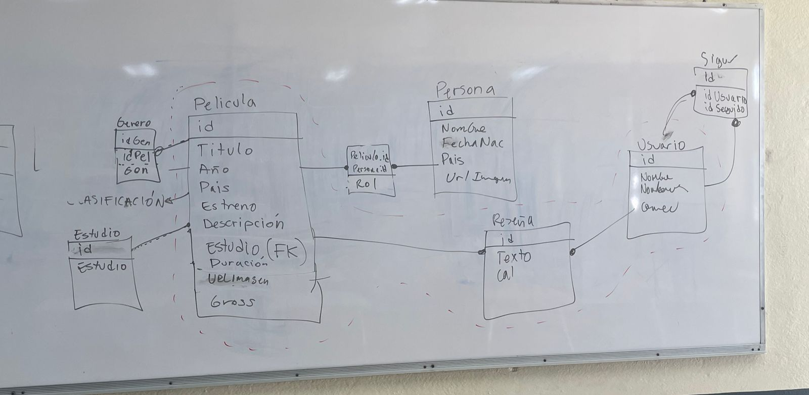
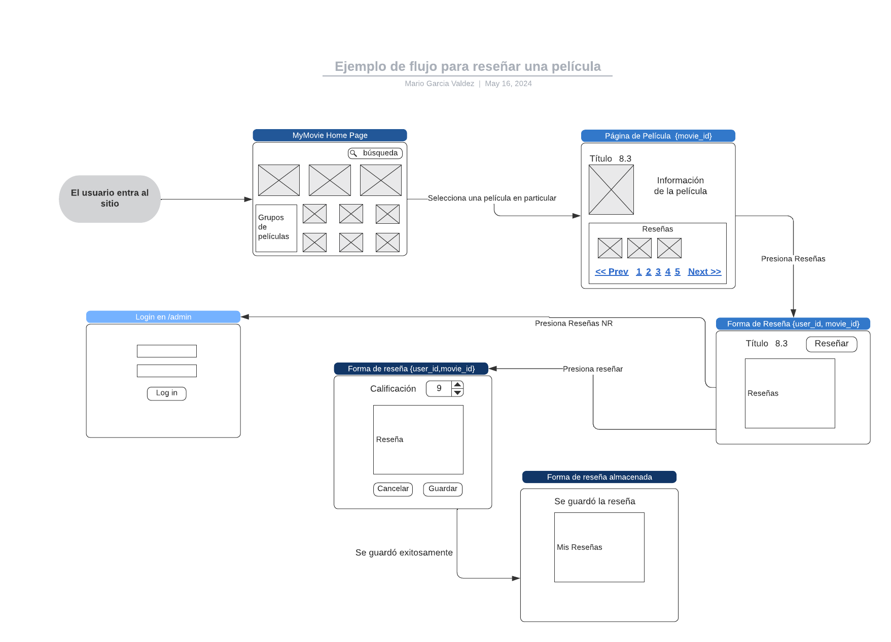

# MyMovies

### Proyecto 2 de la materia de Programación Web

Este proyecto consiste en desarrollar una aplicación  
web para recomendar películas a los usuarios. Para este
proyecto utilizaremos el framework [django](https://www.djangoproject.com/). Este framework
es uno de los más populares en Python, su fuerte es
el lado del servidor e incluye un [ORM](https://docs.djangoproject.com/en/4.2/topics/db/models/) muy completo, 
un [lenguaje de platillas](https://docs.djangoproject.com/en/4.2/topics/templates/) y la capacidad de 
crear una [aplicación](https://docs.djangoproject.com/en/4.2/ref/contrib/admin/) para administrar el contenido de la base de datos.

El proyecto consiste en:
1. Implementar mínimo el modelo que se muestra dentro de las líneas punteadas en la imágen.
2. Una página principal donde se muestren las películas más recientes.
3. Una página para votar y/o reseñar una película.
4. Una sección dónde se muestren varias películas recomendadas.
   * Se debe implementar un algoritmo de recomendación, por ejemplo, uno de  [filtrado colaborativo](https://github.com/mariosky/recommender/).
6. Una página para ver el detalle de una película.
7. Una página para ver el detalle de un actor.

Ejemplo del flujo para realizar una reseña: 

## Detalles

* La aplicación se desarrollará en equipo.
* Se debe tener una instancia en AWS para mostrar la página.
* Debe estar disponible en un repositorio de GitHub.
* Se debe grabar un video de ~5 minutos explicando el proyecto.
* El repo debe tener issues e integrantes asignados a las tareas.

### API

Vamos a utilizar el API del sitio [TMDB](https://developer.themoviedb.org) 

Fecha de entrega: 20 de mayo.
